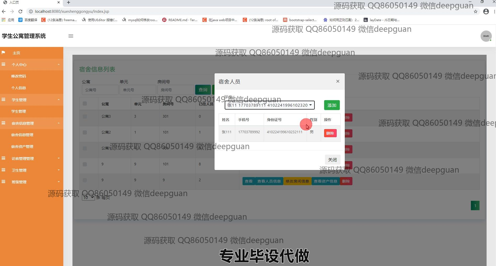

<h1 align="center">学生公寓管理系统的设计与实现</h1>

## 简介
学生公寓管理系统：角色分为管理员、用户；提供登录验证、学生信息管理、宿舍信息管理、宿舍资产管理、宿舍卫生管理和访客管理等功能，提高管理效率和用户体验。    --计算机毕业设计源码；毕设源码；java毕业设计源码

## 联系方式

<h3 align="center">获取完整代码与数据库文件 + 微信：deepguan QQ: 86050149 QQ群: 783742310</h3>

<h3 align="center">可帮忙远程部署 包运行成功！提供远程部署、修改代码、设计文档指导、代码讲解等服务！</h3>

## 功能介绍（完整见运行截图）
管理员：  
基本功能：登录、注册、修改密码，退出系统。  
宿舍管理：管理学生的入住信息，包括宿舍分配、入住登记、查询及维护宿舍资产状态，如床、桌子等。  
学生管理：维护学生信息，如姓名、性别、联系方式、身份证号等，同时支持批量操作。  
卫生管理：记录宿舍卫生评分、检查时间及评分维护，支持查看、修改和删除卫生记录。  
班级管理：管理班级信息，提供班级列表的查询、添加、修改、删除功能。  

学生：  
基本功能：登录、修改密码、退出系统。  
个人信息：查看和更新个人资料，包括账号、姓名、性别、联系方式等。  
宿舍信息：查看已分配宿舍的信息，包括宿舍号、资产状态、入住时间等。  
卫生评分：查看宿舍的卫生评分和检查记录，协助改进卫生状况。

## 运行截图

本代码来源于网络,仅供学习参考使用!

